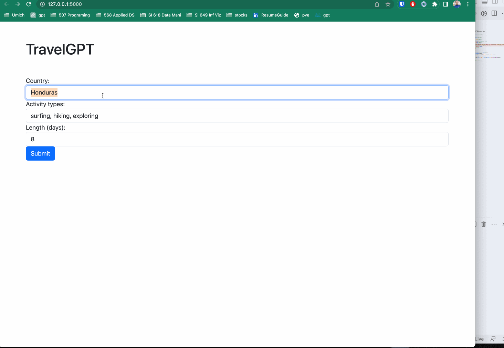

# Travel AI ✈️

Travel AI ✈️ is a web app built with flask and openAI. It is designed to generate vacation plans for users based on the
country, activity types, and duration of their trip. It makes use of OpenAI’s natural language generation and completion
services to generate a comprehensive description of activities and locations from the user’s input.

## Installation 🏗️

### Prerequisites

* Python 3.7+
* Flask
* OpenAI Python SDK
* dotenv

### Setup

1. Clone the repo
   bash git clone https://github.com/membriux/openai-travelbot.git 
1. Install project dependencies:
   `pip install -r requirements.txt`
1. Create `.env` file and Add your API key:
   `OPENAI_API_KEY=YOUR_API_KEY`
1. Run the app
   `python app.py`
1. Head over to the app on your browser and start planning your next trip! [localhost:5000](http://localhost:5000)

## Walkthrough/Demo

